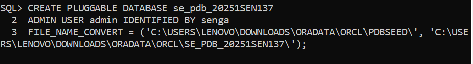
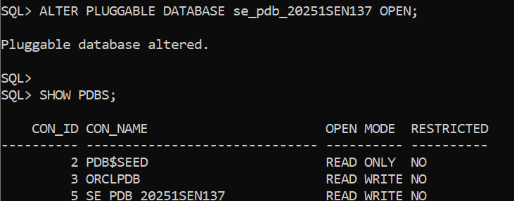
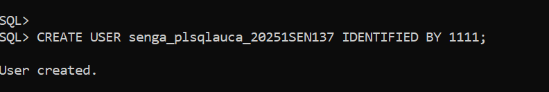
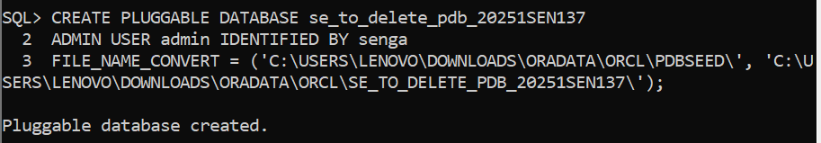
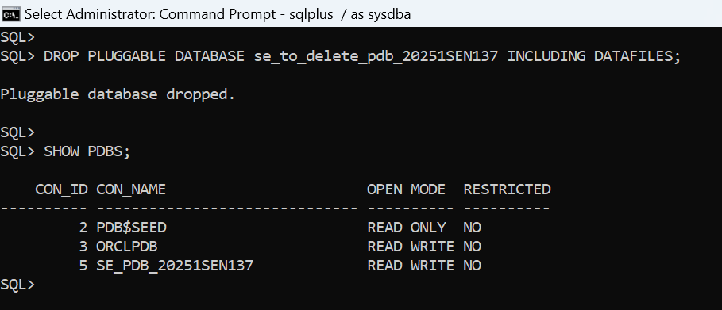
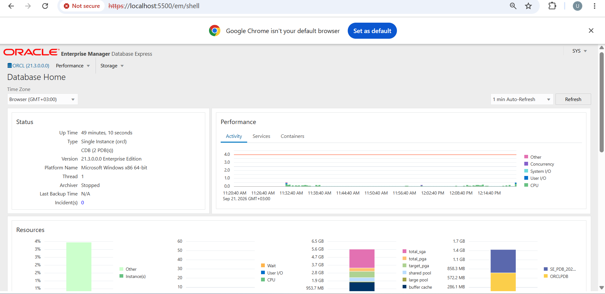

# Oracle Pluggable Databases (PDB) Management - Assignment II Report

## Course & Submission Details
  **Student Name:** Senga Aphrodis
  
 **Student ID:** 20251SEN137
- **Course Name:** Database Development with PL/SQL (INSY 8311)
- **Instructor:** Eric Maniraguha
- **Teaching Assistant:** Afanyu Emmanuel
- **Submission Date:** September 22, 2026

---

## Submission Details Block
- **Repository Link:** https://github.com/aphroseng/oracle_pdb_ass_II_20251SEN137_senga
- **PDB Name Created:** se_pdb_20251SEN137
- **Issues Encountered:** Yes

---

## Overview of Tasks
This repository contains the official technical report and visual evidence for INSY 8311 Individual Assignment II. The assignment demonstrates practical proficiency in Oracle Multitenant Architecture, including PDB creation, user management, PDB lifecycle deletion, Oracle Enterprise Manager (OEM) verification, and technical documentation on GitHub.

---

## Oracle Environment Used
- **Database Engine:** Oracle Database 21c Enterprise Edition (Release 21.3.0.0.0)
- **Operating System:** Microsoft Windows x86 64-bit
- **Architecture:** Multitenant Container Database (CDB)
- **Container Database (CDB):** `CDB$ROOT`
- **Primary Pluggable Database (PDB):** `se_pdb_20251SEN137`
- **Created User inside PDB:** `senga_plsqlauca_20251SEN137`

---

## Task Execution Details & Explanations

### Task 1: Create a New Pluggable Database & User Setup
1. Created the primary pluggable database `se_pdb_20251SEN137` from the `PDBSEED` template following the strict naming convention (`FirstTwoLettersOfFirstName_pdb_Student ID`).
2. Opened the PDB in `READ WRITE` mode to make it active for user sessions.
3. Created the dedicated local user `senga_plsqlauca_20251SEN137` inside `se_pdb_20251SEN137` following the exact format (`FirstName_plsqlauca_StudentID`) and assigned DBA privileges for future class activities.

#### Task 1 Evidence Screenshots:

---

### Task 2: Create and Delete a Temporary PDB
1. Created a temporary pluggable database named `se_to_delete_pdb_20251SEN137` following the naming convention (`FirstTwoLettersOfFirstName_to_delete_pdb_Student ID`).
2. Verified the active existence of the temporary PDB using `SHOW PDBS;`.
3. Closed and executed `DROP PLUGGABLE DATABASE se_to_delete_pdb_20251SEN137 INCLUDING DATAFILES;` to completely wipe out the database files from disk.
4. Confirmed the complete removal from the container catalog.

#### Task 2 Evidence Screenshots:

---

### Task 3: Oracle Enterprise Manager (OEM) Setup & Verification
Accessed the local Oracle Enterprise Manager Express web interface at `https://localhost:5500/em` using the `SYS` administrative account. Verified that the dashboard accurately reflects the running Oracle 21c environment, active instance performance, and connected PDB containers.

#### Task 3 Evidence Screenshot:

---

## Challenges Faced & Resolution Strategy
- **ORA-65005 (File Name Convert Error):** Encountered on Windows OS when creating PDBs without explicit file destination clauses. Resolved by supplying concrete directory file paths or configuring file name patterns.
- **OEM Access & Container Scope:** Encountered container name mismatch during OEM login. Resolved by connecting directly via `CDB$ROOT` to view all attached PDBs.

---

## Academic Integrity Statement
"Excellence is never an accident; it is the result of discipline, commitment, and integrity."
I declare that this submitted work is my own individual assessment executed independently. No commands, screenshots, or code solutions were copied or generated using unauthorized AI tools, in full compliance with the course policies.
